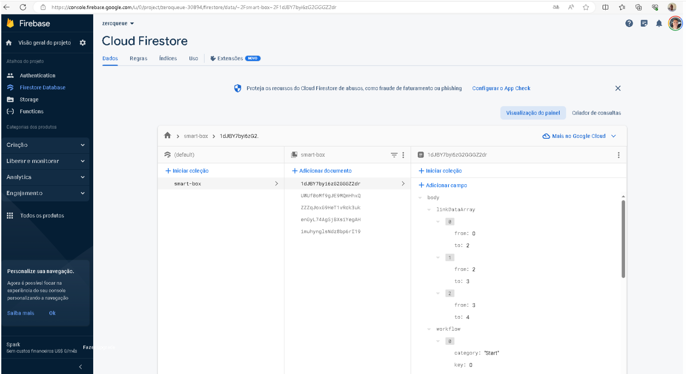
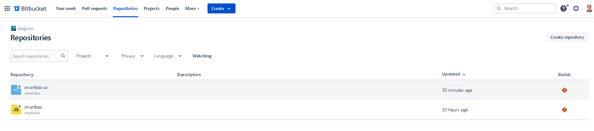
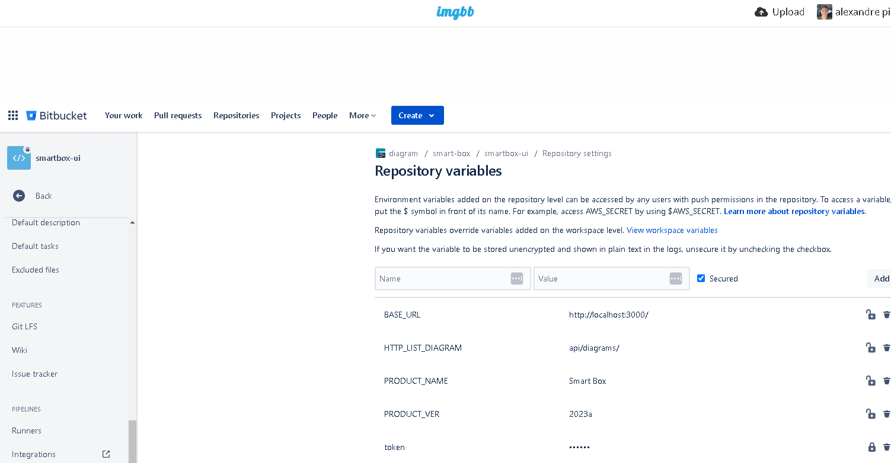
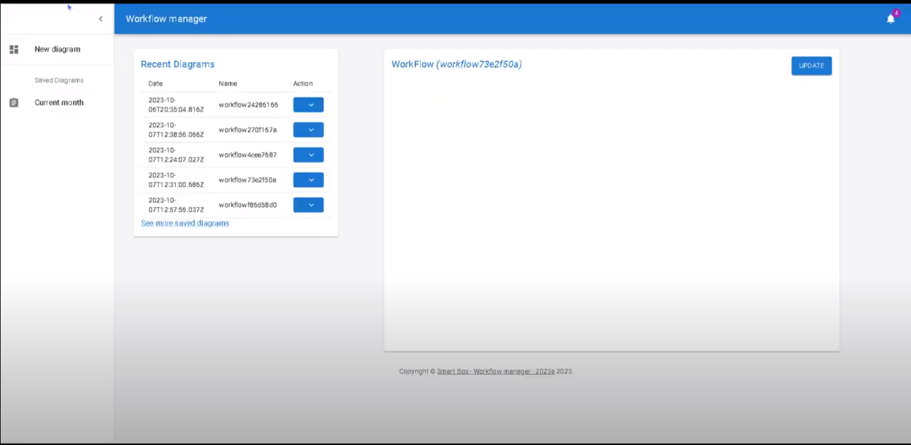
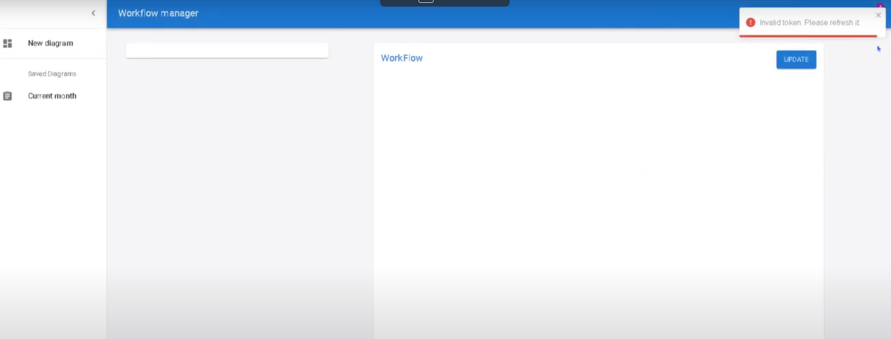
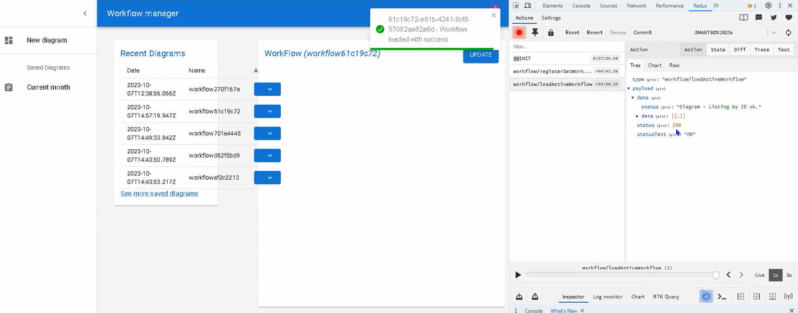

# smart-box-ui

## React/TypeScript/Redux Mui

author: Alexandre (alexandre.pisani.ant@gmail.com)

##### NPM 

-   npm i
-   npm run start

### Create .env.development and setup it with the vars below.
#### Setup a google cloud firebase with your own ID
```
BASE_URL=http://localhost:3000/
HTTP_LIST_DIAGRAM=api/diagrams/

PRODUCT_NAME=Smart Box
PRODUCT_VER=2023a
token= (Generated by api. Download insomnia apis below and run token GET api)
```

## Firebase GCP (stored the collection smart-box)
 - 

## BitBucket repos
 - 

## BitBucket Repository variables
 - 

## Short video - Navigation thru App
 - [](https://youtu.be/LajYlLFOY7E)

## Short video - Invalid Google token
 - [](https://youtu.be/82PaYL__0Vk)

## Short video - State by Redux
 - [](https://youtu.be/a3SgXQx83ps)